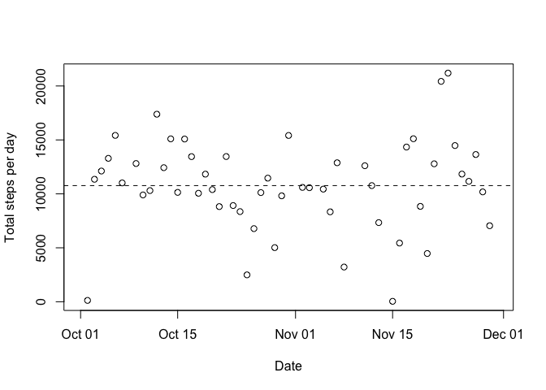
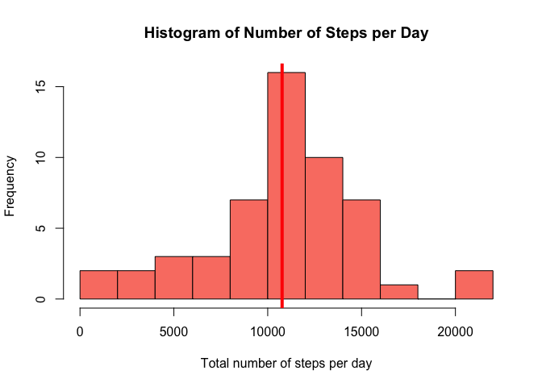
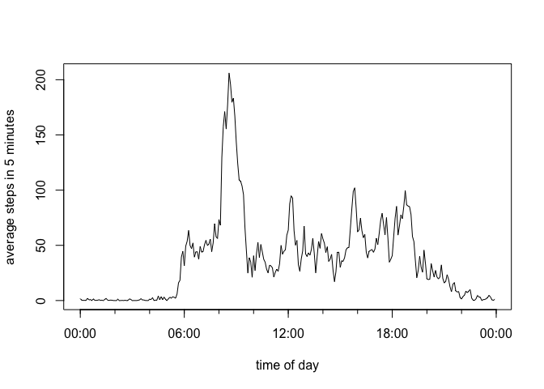
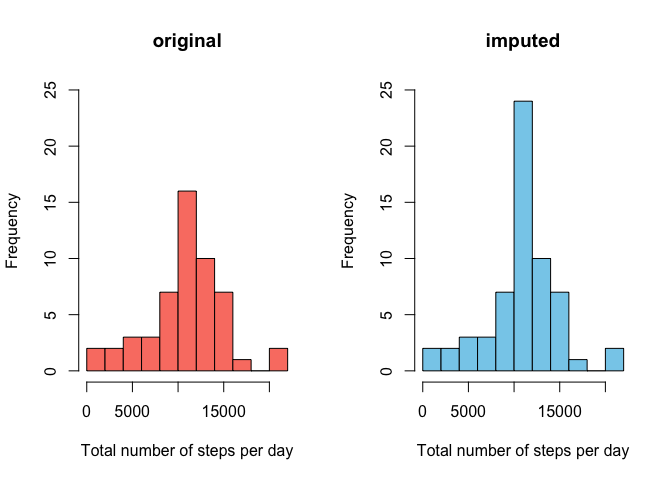
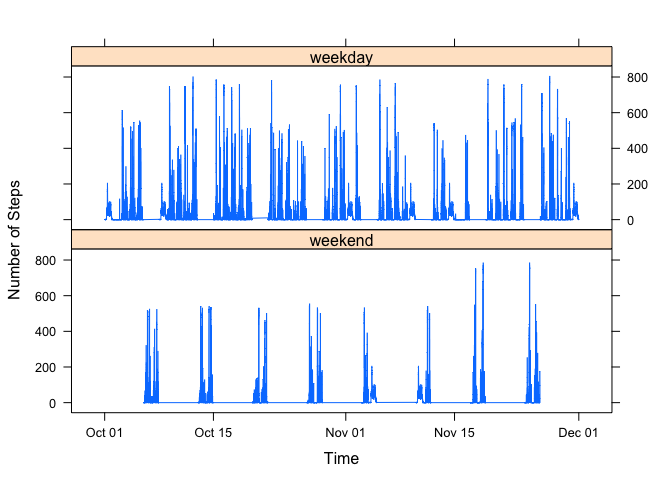
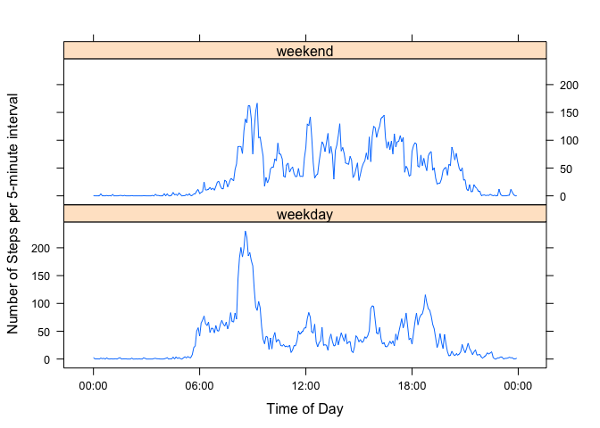
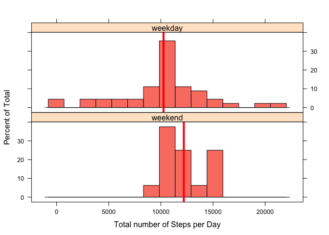

# Reproducible Research: Peer Assessment 1

We analyze a 2-month data stream from a fitbit-like activity monitor (step counter). We determine the changes in activity over time, the daily pattern, and investigate differences between weekday and weekend activity profiles.

## Loading and preprocessing the data

### Loading Data

Set the working directory to "RepData_PeerAssessment1/" to access zip file "activity.zip". Unzip the data file provided to create the data file "activity.csv"


```r
unzip("activity.zip")
dir()
```

```
## [1] "activity.csv"       "activity.zip"       "doc"               
## [4] "instructions_fig"   "PA1_template_files" "PA1_template.html" 
## [7] "PA1_template.md"    "PA1_template.Rmd"   "README.md"
```

Load the CSV file into R and check the content:


```r
activity <- read.csv("activity.csv")
str(activity)
```

```
## 'data.frame':	17568 obs. of  3 variables:
##  $ steps   : int  NA NA NA NA NA NA NA NA NA NA ...
##  $ date    : Factor w/ 61 levels "2012-10-01","2012-10-02",..: 1 1 1 1 1 1 1 1 1 1 ...
##  $ interval: int  0 5 10 15 20 25 30 35 40 45 ...
```

The variables are:

* **steps**: number of steps taken in a 5-minute interval

* **date**: date on which measurement was taken in YYYY-MM-DD format.
               Saved as a string variable, interpreted as a factor

* **interval**: identifier for the 5-minute interval in which measurement was taken. Encoded as an integer in the format HHMM, that is, 55 is followed by 100 (= 1:00)

Note: missing values in **steps**. See below for details.


### Preprocessing Data

As the data is analyzed as a function of time we combine the date and time information into a new `date.time` variable in POSIX format for ease of plotting and analysis. 


```r
activity$date.time <- with(activity, strptime(paste(date, sprintf("%04d", interval)), format="%Y-%m-%d %H%M"))
```


## What is mean total number of steps taken per day?

### Analysis

Add the number of steps for every single day and take the mean of the resulting daily totals. Ignore days without step recordings.


```r
day.sum <- tapply(activity$steps, activity$date, sum)
avg.steps <- mean(day.sum, na.rm = TRUE)
avg.out <- format(avg.steps, digits = 6, nsmall = 1)
```

The subject took on average 10766.2 steps per day.

### Plots

For illustration we plot the total number of steps taken every day to compare it to the average. The dates are saved in the `names()` attribute of `day.sum`. 


```r
plot(as.Date(names(day.sum)), day.sum, ylab = "Total steps per day", xlab = "Date")
abline(h = avg.steps, lty = 2)
```

 

The distribution of the number of steps per day (together with the mean) is shown in the following histogram:


```r
hist(day.sum, breaks = 10, xlab = "Total number of steps per day", main = "Histogram of Number of Steps per Day", col = "salmon")
abline( v = avg.steps, lwd = 4, col = "red")
```

 

As the distribution is not symmetric, we also calculate the median of the number of steps:


```r
median.steps <- median(day.sum, na.rm = TRUE)
median.out <- format(median.steps, digits = 6, nsmall = 1)
```

The subject took a median of 10765 steps per day. this is very close to the mean of 10766.2 steps.


## What is the average daily activity pattern?

### Analysis

We average the number of steps for every 5-minute time interval over all days for which recordings exist. For ease of plotting we generate a `time.of.day` variable that encodes the time of day in POSIX format. By default the current date will be added to this variable. This date is not relevent and will be igored. We combine the two variables in a new data frame.


```r
daily.mean <- tapply(activity$steps, activity$interval, mean, na.rm = TRUE)
time.of.day <- as.POSIXlt(sprintf("%04d", as.integer(names(daily.mean))), format = "%H%M")
daily.steps <- data.frame(time.of.day, daily.mean)
```


### Plot

We overwrite the default time axis format (which skips the first tick at midnight and separates the main ticks by 5 hours) with a more easily readable 6-hour tick frequency.


```r
axis.range <- round(range(daily.steps$time.of.day), "hours")
with(daily.steps, plot(time.of.day, daily.mean, type = "l", xaxt = "n", xlab = "time of day", ylab = "average steps in 5 minutes"))
axis.POSIXct(1, at = seq(axis.range[1], axis.range[2], by = "6 hours"), format = "%H:%M")
axis.POSIXct(1, at = seq(axis.range[1], axis.range[2], by = "2 hours"), labels = FALSE, tcl = -0.25)
```

 


### Discussion

One notices a large peak about 8:30 to 9:00 (morning commute?), some minor peaks around noon (lunch time?) and 16:00, as well as around 18:00 to 19:00 (evening walk, jog?). The activity is very close to zero between 22:00 and 5:30 to 6:00 (night rest).

Finding the maximum activity:


```r
max.mean <- max(daily.steps$daily.mean)
max.index <- which.max(daily.steps$daily.mean)
max.time <- daily.steps[max.index, "time.of.day"]
max.time.out <- format(max.time, format = "%H:%M")
max.mean.out <- prettyNum(max.mean)
```

The largest average activity of 206.1698 is recorded at 08:35.


## Imputing missing values

The step count variable contains some missing values. 


```r
sum(is.na(activity$steps))
```

```
## [1] 2304
```

The total number of `NA` values is a multiple of number of observations for each day.


```r
sum(is.na(activity$steps)) / nrow(daily.steps)
```

```
## [1] 8
```

This is no coincidence, upon further inspection we notice that the missing values in `steps` are not mixed with actual step counts within a single day, that is, the step counts for one day are **either all** `NA` (a total of 288 observations per day) **or none**:


```r
unique(tapply(activity$steps, activity$date, function(x){sum(is.na(x))}))
```

```
## 2012-10-01 2012-10-02 
##        288          0
```


### Imputation

`NA` values therefore indicate that the data for en entire day are missing. It is not known why the counts are missing, but if we assume that nothing special happened on those days with missing counts we could simply replace the missing data with the average step count for this time interval.

To preserve the original data, we make a copy of the imported values and do the replacement on this new data frame:


```r
imputed.activity <- activity
imputed.activity[, "steps"] <- with(imputed.activity, ifelse(is.na(steps), daily.steps$daily.mean[as.character(interval)], steps))
head(activity$steps); head(imputed.activity$steps)
```

```
## [1] NA NA NA NA NA NA
```

```
## [1] 1.7169811 0.3396226 0.1320755 0.1509434 0.0754717 2.0943396
```

### Averages

To check that the imputation did not negatively affect the results, let's compare the mean and median number of steps per day as well as the histogram of the total number of steps per day with and without imputation.


```r
day.sum.imputed <- with(imputed.activity, tapply(steps, date, sum))
avg.steps.imputed <- mean(day.sum.imputed)
avg.out.imputed <- format(avg.steps.imputed, digits = 6, nsmall = 1)
median.steps.imputed <- median(day.sum.imputed)
median.out.imputed <- format(median.steps.imputed, digits = 6, nsmall = 1)
```

The average number of steps after imputation is 10766.2, which (not surprisingly) is identical to the mean without imputation (10766.2). The medians are also similar: 10766.2 after imputation, compared to 10765 without imputation. Due to the imputation, the median shifted up to the average.


### Histogram

We also compare the histogram with imputation (blue) to that without (red):


```r
par(mfrow=c(1,2))
hist(day.sum, breaks = 10, xlab = "Total number of steps per day", main = "original", col = "salmon", ylim=c(0, 25))
hist(day.sum.imputed, breaks = 10, xlab = "Total number of steps per day", main = "imputed", col = "skyblue", ylim=c(0,25))
```

 

As the 8 days without data are now imputed with the average number of steps per day (10766.2), the histogram bar above 10000 steps grows by 8, while the remainder of the histogram remains the same.


## Are there differences in activity patterns between weekdays and weekends?

We investigate if there are differences in the activity pattern between weekdays and weekend days. First we generate a new weekday factor in the data frame of the imputed data to show if the day is a weekend or a weekday.


```r
weekday <- weekdays(imputed.activity$date.time)
imputed.activity$weekend <- factor(is.element(weekday, c("Saturday", "Sunday")), levels=c("TRUE", "FALSE"), labels=c("weekend", "weekday"))
str(imputed.activity)
```

```
## 'data.frame':	17568 obs. of  5 variables:
##  $ steps    : num  1.717 0.3396 0.1321 0.1509 0.0755 ...
##  $ date     : Factor w/ 61 levels "2012-10-01","2012-10-02",..: 1 1 1 1 1 1 1 1 1 1 ...
##  $ interval : int  0 5 10 15 20 25 30 35 40 45 ...
##  $ date.time: POSIXlt, format: "2012-10-01 00:00:00" "2012-10-01 00:05:00" ...
##  $ weekend  : Factor w/ 2 levels "weekend","weekday": 2 2 2 2 2 2 2 2 2 2 ...
```

Let's compare the pattern over time between weekends and weekdays:


```r
library(lattice)
xyplot(steps ~ as.POSIXct(date.time) | weekend, data = imputed.activity, layout=c(1,2), type = "l", ylab = "Number of Steps", xlab = "Time")
```

 

### Average Daily Patterns on Weekends and Weekdays

Due to the large oscillations during every single day, this plot tells little, a better comparison might be to aggregate into average daily patterns and compare the weekday and weekend **average** instead:


```r
weekday.mean <- tapply(imputed.activity[imputed.activity$weekend=="weekday", "steps"], imputed.activity[imputed.activity$weekend=="weekday", "interval"], mean)
weekly.steps <- data.frame(time.of.day, weekly.mean = weekday.mean, weekend = as.factor(rep("weekday", length(weekday.mean))))
weekend.mean <- tapply(imputed.activity[imputed.activity$weekend=="weekend", "steps"], imputed.activity[imputed.activity$weekend=="weekend", "interval"], mean)
weekly.steps <- rbind(weekly.steps, data.frame(time.of.day, weekly.mean = weekend.mean, weekend = as.factor(rep("weekend", length(weekend.mean)))))
```

Note: we reused the `time.of.day` variable created earlier.

Let's plot the comparison:


```r
xyplot(weekly.mean ~ time.of.day | weekend, data = weekly.steps, layout = c(1,2), scales = list(format="%H:%M"), ylab = "Number of Steps per 5-minute interval", xlab = "Time of Day", type = "l")
```

 

We notice generally speaking a higher average activity level on the weekends, with the exception of the "morning commute"" and the early morning period. 


### Total daily activity on Weekends and Weekdays

The suspicion of a higher activity level is confirmed through the weekend/weekday comparison of both the average number of daily steps and a histogram of the total number of steps for each day:


```r
day.sum.weekday <- weekdays(as.Date(names(day.sum.imputed)))
day.sum.weekend <- factor(is.element(day.sum.weekday, c("Saturday", "Sunday")), levels=c("TRUE", "FALSE"), labels=c("weekend", "weekday"))
day.sum.data <- data.frame(daily.sum = day.sum.imputed, weekend = day.sum.weekend)
avg.by.weekday <- tapply(day.sum.data$daily.sum, day.sum.data$weekend, mean)
avg.by.weekday
```

```
##  weekend  weekday 
## 12201.52 10255.85
```

```r
histogram(~ daily.sum | weekend, data = day.sum.data, col = "salmon", nint=15, layout=c(1,2), xlab = "Total number of Steps per Day", panel = function(x, ...) {
     panel.histogram(x, ...)
     panel.abline(v = mean(x), lwd = 4, col = "red")
})
```

 

## Summary

Our subject exceeded the recommended number of daily steps to take (10000) on almost all weekend days. Some of the weekdays the activity level was lower than recommended. The average weekday plot indicates that very few steps were taken (on average) especially right before and right after noon, so a brief walk to and from lunch might be all it takes to exceed the recommended daily activity level.


